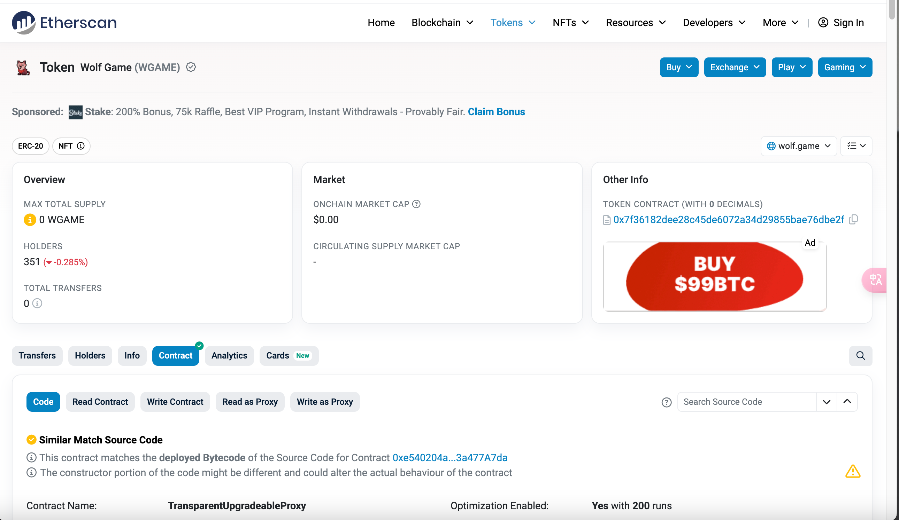
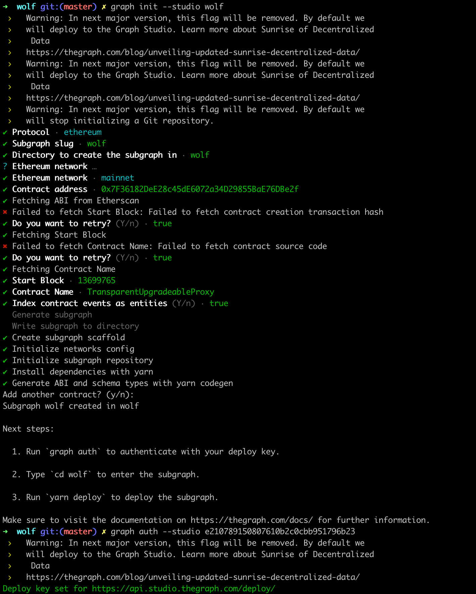
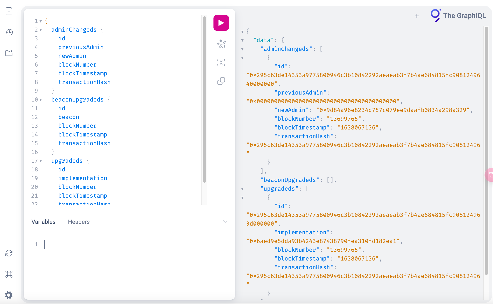

# subgraph

查找合约地址

在命令行中输入`graph init --studio wolf`,然后选择etc,mainnet,输入合约地址`0x7F36182DeE28c45dE6072a34D29855BaE76DBe2f`等,过程如下

子图部署成功进行查询，查询地址`https://api.studio.thegraph.com/query/80234/wolf/v2`

